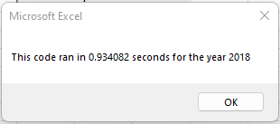

# Greenstocks Analysis

## Overview of Project 

This project analyzes the total daily volume and annual return for 2017 and 2018 for green energy stocks as requested by Steve. 

### Purpose -2 

The goal of this project is to use visual basics application (VBA) to refactor the current green energy stocks code. The data is looped through one time to collect the same information at a short period of time using the VBA timer. The outcome will help Steve diversify his parent’s funds to invest in alternative energy. 

## Analysis of Green Energy Stocks

### All Stocks 2017 and 2018 

The snippets above summarize the stocks for each company that uses alternative energy. The first column has the names while the second and third have the total daily volume and return respectively. 
2017 was a great year for green stock percentage return, unlike in 2018 when only two stocks had positive figures. In addition, the total daily volume was consistent in both years, most stocks had a high volume which either increased or decreased in 2018.

Below are screenshots of the amount of time it took for the VBA script to run using the initial code.

## Results, Challenges and Difficulties Encountered

### Results

- Steve received a precise breakdown of annual returns as well as daily volumes which helped him make more informed investing decisions for his parents

- Utilizing tables with colors provided results in a clear, visual format

- Refactored code expedited the process

### Advantages

- Multiple growth opportunities through researching and debugging

- Run time is reduced exponentially

- Less steps required using the refactored code 

### Challenges

- Time consuming research as well as tedious debugging

- Diverse options of code to choose from for project
 
- Outcomes maybe altered in the process
